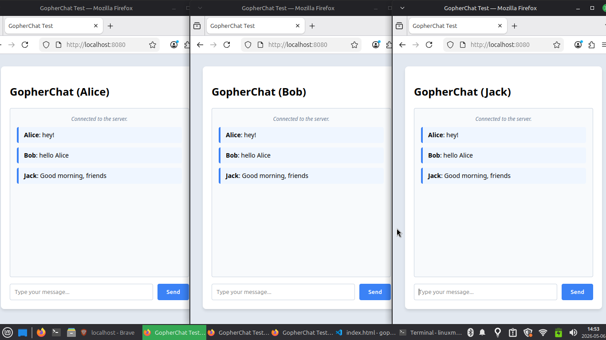

# GopherChat 🚀




GopherChat is a horizontally scalable, real-time messaging engine built in Go. It moves beyond standard WebSocket tutorials by implementing a distributed pub/sub architecture, allowing the application to scale across multiple server instances while maintaining message state.

## 🧠 System Architecture

To solve the limitations of a single-server WebSocket application (where users on Server A cannot chat with users on Server B), this engine utilizes a **Stateless Routing** pattern.

1. **Client Connections:** Handled by standard `gorilla/websocket` with dedicated Read/Write goroutines per user.
2. **Message Brokering:** When a message is received, the Go Hub publishes it directly to a **Redis Pub/Sub** channel. 
3. **Horizontal Scaling:** Every running Go server instance subscribes to the Redis channel. When a message hits Redis, it is instantly fanned out to all servers, which then push the message to their local connected WebSocket clients.
4. **Persistence:** Messages are asynchronously persisted to **PostgreSQL** before being published to Redis, ensuring chat history is preserved across sessions.

## ⚙️ Tech Stack

* **Backend Engine:** Go (Standard Library `net/http`)
* **Real-Time Protocol:** WebSockets (`gorilla/websocket`)
* **Message Broker:** Redis (Alpine)
* **Database:** PostgreSQL (Alpine)
* **Containerization:** Docker & Docker Compose

## 🚀 Quick Start (Under 3 Minutes)

You can run the entire infrastructure locally using Docker. 

### Prerequisites
* Go 1.22+ installed
* Docker and Docker Compose installed

### Installation

1. **Clone the repository:**
   ```bash
   git clone https://github.com/Chintukr2004/gopher-chat.git
   cd gopher-chat
   ```

2. **Start the Infrastructure (Redis & Postgres):**
   ```bash
   docker-compose up -d
   ```

3. **Start the Go Engine:**
   ```bash
   go run main.go hub.go client.go db.go
   ```

4. **Test the System:**
   Open multiple browser tabs to `http://localhost:8080`. Type a message in one tab and watch it instantly propagate to all other tabs. Refresh the page to see the PostgreSQL persistence in action!

## 📁 Project Structure
```text
.
├── client.go           # WebSocket Read/Write pumps (per user)
├── db.go               # PostgreSQL connection & auto-migration
├── docker-compose.yml  # Infrastructure setup (Redis/Postgres)
├── hub.go              # Core routing, Redis Pub/Sub integration
├── index.html          # Vanilla JS frontend for testing
└── main.go             # Entry point & HTTP/WS handlers
```

